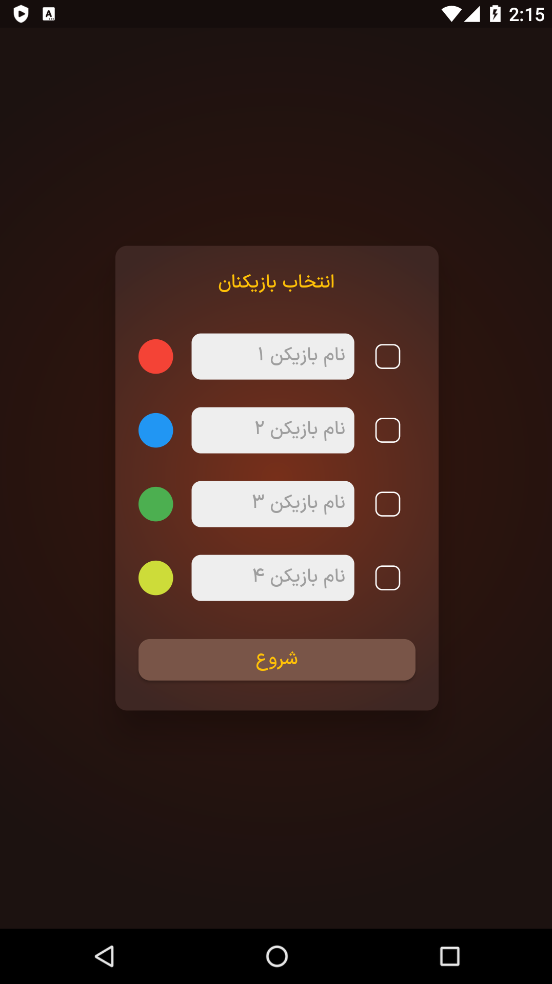
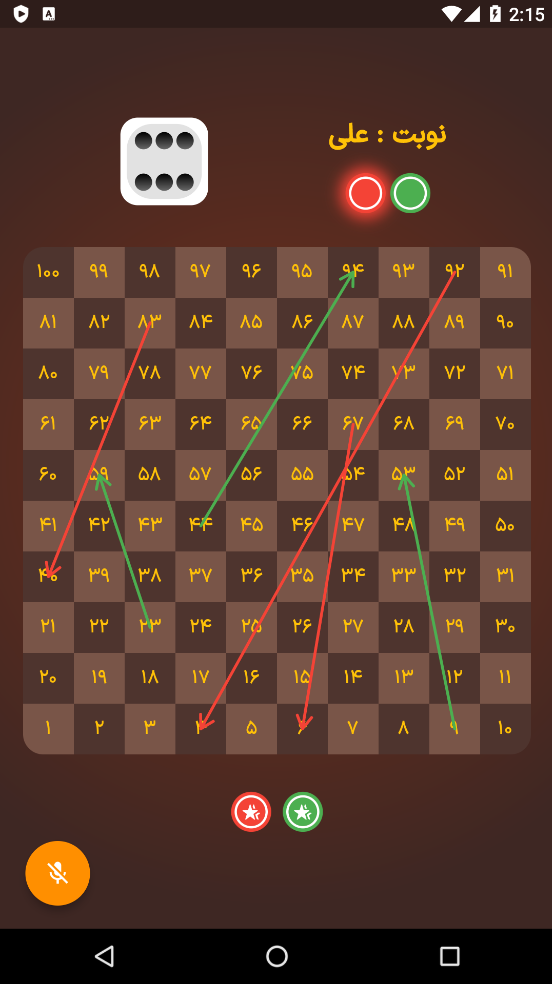
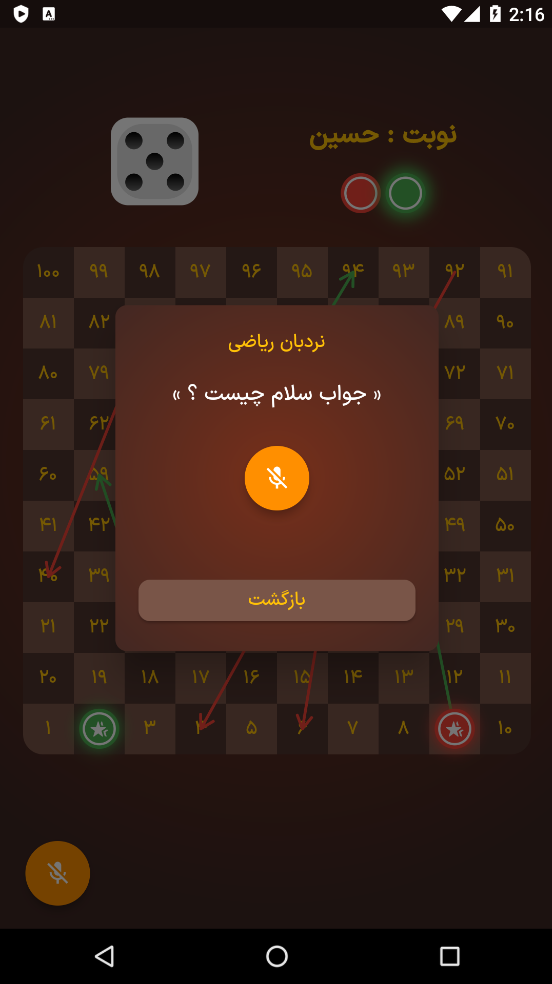

# Snake and Ladder Game with Speech Recognition

Welcome to the "Snake and Ladder with Speech Recognition" game, a unique twist on the classic board game that combines traditional gameplay with cutting-edge speech recognition technology. This project was developed using the Flutter framework as part of the "Speech Processing" course at Jahrom University, under the guidance of Dr. Ehsan Amiri.

## Screenshots

1. **Home Screen and Player Setup**
   
<p align="center">
  
</p>
   
   The home screen allows players to select their preferred color and set their names for the game beads. 

2. **Gameplay with Snakes, Ladders, and Speech Recognition**
   
<p align="center">
  
</p>

   This screenshot showcases the main gameplay screen. You can see the snakes and ladders on the board, with players' dice at the bottom. The floating action button (FAB) in the bottom-left corner initiates dice rolling by recognizing the spoken word "تاس" (meaning "dice" in Persian). The game responds to this voice command and automatically moves the player's bead accordingly.

3. **Ladder Challenge with Speech-Enabled Question**
   
<p align="center">
  
</p>
   
   When a player lands on the starting point of a ladder, an interactive challenge begins. To climb the ladder, the player must correctly answer a question. The game employs the device's microphone for speech recognition, adding an engaging and immersive aspect to the gameplay.

5. **Victory Celebration**
   
<p align="center">
  
</p>
   
   This screenshot captures the excitement of a player reaching the final house, signifying victory. It's the ultimate achievement in the game.

## Unique Gameplay Feature: Dynamic House Numbering

One of the standout features of this project is the innovative approach to dynamically numbering the houses on the game board. This numbering system was created using a mathematical formula, and the implementation can be found in the `lib\view\screen\home\widget\board\board.dart` file, specifically in lines 34 to 41:

```dart
child: Center(
  child: Text(
    ((index ~/ 10) % 2 == 1)
        ? (((index ~/ 10) * 20) + 10 - index).toString()
        : (index + 1).toString(),
    style: const TextStyle(color: Colors.amber),
  ),
),
```

This formula maps house numbers to the matrix layout of the game board, providing a seamless and visually appealing way to display the house numbers while ensuring they correspond to the gameplay mechanics.

Feel free to explore the code and adapt this approach to similar projects. We hope you enjoy playing "Snake and Ladder with Speech Recognition" as much as we enjoyed creating it. Your feedback and contributions are welcome!
